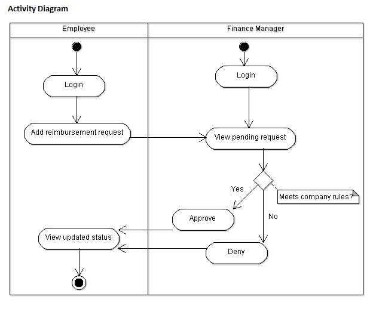
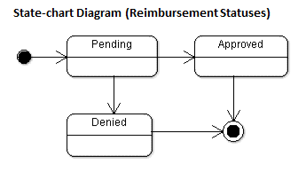
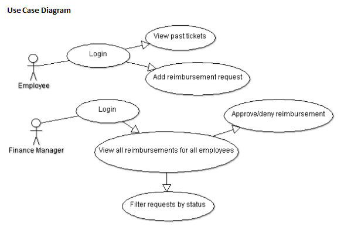

# Foundations Project

This is your first individual project at Revature. You are tasked with creating a ticketing reimbursement system for a company. To have an idea of what is expected of you, watch the following below:

[Project Completion Demo](https://drive.google.com/file/d/1DmA__wMgUeRsaG-Ad4zYe8HUH6OBHB3J/view?usp=sharing)

This project will require you to use technologies that you may have not come across yet but will in the course of training. Make sure to plan ahead, and have a clear idea of what you need for the project and what you can complete with what you have learnt. Do not leave this project to after you have learnt all the technologies. The required features must be completed and presented during a 5 minute timeslot for presentation of the project and 5 minutes for Q/A. Extension features are available for undertaking once the required features are completed, but they do not contribute to your projects completion.

## Required Technolgies

- NodeJS
- DynamoDB
- AWS SDK
- ExpressJS
- Jest
- Postman

## Preliminary Work

### GitHub Repository

- Setup personal repository for Foundation Project on GitHub
- Clone the repository to your computer and initialize it
- Create your first commit on you computer
- Complete your first push to the repository on GitHub

### Use Case Design

- Understand what your application is meant to do
- Review the diagrams

 
 

### Glossary of Terms

#### Feature

A feature is a unit of functionality of a software system that satisfies a requirement, represents a design decision, and provides a potential configuration option.

#### User Story

A user story is an informal, general explanation of a software feature written from the perspective of the end user or customer. The purpose of a user story is to articulate how a piece of work will deliver a particular value back to the customer.

#### MVP

Minimum Viable Product - a version of a product with just enough features to be usable by early customers who can then provide feedback for future product development.

#### Stretch

Stretch Goal - an optional extension feature beyond the minimum viable product requirements.

#### Reimbursement

Reimbursement is compensation paid by an organization for out-of-pocket expenses incurred or over-payment made by an employee, customer, or another party.

#### Ticketing System

A ticketing system is a software program that a support team uses to manage, process, and maintain a list (or lists) of reimbursement requests.

## Required Features

### Login / Register Feature

The login and register feature is meant to give you preliminary experience handling authentication within an application. These features allow you to ensure you can track or maintain who can connect to your application.
User Stories
As an Employee or Manager, I should be able to log into the application.

Ability to register a new account

- Must ensure the username is not already registered
- Default employee role
- Should register with at least a username and password

### Submit Ticket Feature

The submit ticket feature is meant to guide you through input acceptance, validation, and error handling. The ability to submit a reimbursement request ticket is the core functionality of this application.
User Stories
Employees can submit a new reimbursement ticket

- Must have an amount
- Must have a description
- Should have a default status of Pending

### Ticketing System Feature

The ticketing system feature is meant to act as the primary interface for internal managers. Managers will use this interface to process the pending reimbursement request tickets and either approve or deny these requests.
User Story
Managers can process tickets submitted by employees

- Tickets can be Approved or Denied
- Tickets cannot change status after processing
- Pending tickets should be added to a queue or list that managers can see
- Tickets should be removed from the list, or queue, once processed (approved/denied) by a manager

### View Previous Tickets Feature

The view previous tickets feature is meant for employees to see their request submission history. Employees will leverage this to see outstanding pending tickets along with tickets that have been processed by managers.
User Story

- As an Employee, I should be able to view all previous reimbursement ticket submissions.
- Previous tickets should also show the details of submission.

70% Code Coverage from Testing
## Extension Features

### Frontend

User Story
As an Employee or Manager, I can access the application using a frontend website.

- Using HTML, CSS, and JavaScript, create a frontend to interact with your API.

### Reimbursement Types Feature

User Story
Employees can add Reimbursement Types

- Travel, Lodging, Food, Other
- Employees can view previous requests filtered by type

### Change Roles Feature

User Story
Managers can change other users’ roles

- Employee to Manager or back to Employee

### Upload Receipts Feature

User Story
Employees can add images of receipts to their reimbursement requests

- Upload and store images (in SQL or cloud storage)

### User Accounts Feature

User Story
User Profile/Account

- Track additional user information (name, address, etc.)
- Users can edit their account
- Users can add a profile picture
